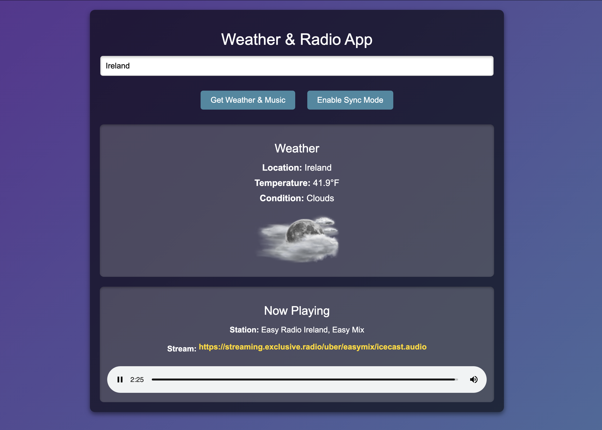
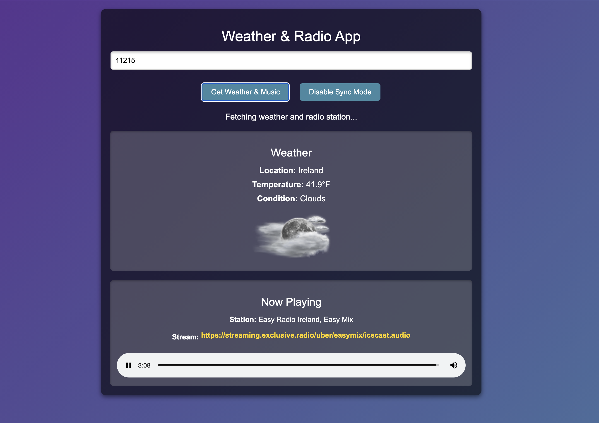
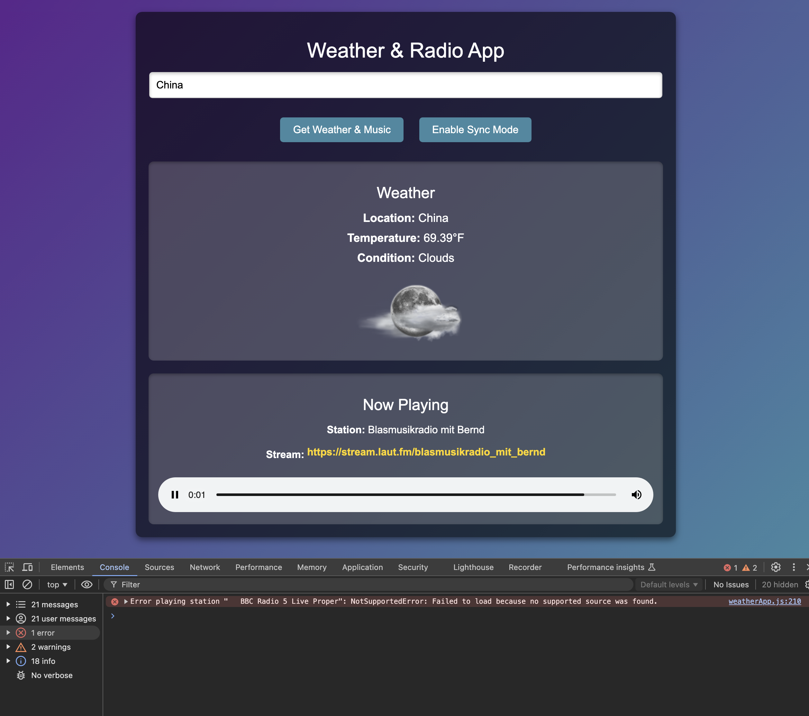

# **Weather and Music Sync Mode Project**

This project has been an exciting learning journey that has deepened my understanding of JavaScript and its role in creating interactive, user-focused applications. The goal was simple: fetch weather data and pair it with radio stations for an engaging, functional experience. Along the way, I encountered challenges, explored solutions, and built something I’m proud of, with room for future enhancements.

---

## **Understanding as a Building Process**

When I started this project, the concepts of synchronous vs. asynchronous operations were theoretical. Through implementing the "Sync Mode" toggle, I came to understand how delays and asynchronous behavior can simulate real-world application performance. Sync Mode gives users a glimpse into how asynchronous processes, like fetching data from APIs, can run in parallel without blocking the application. While this is simulated here, it’s the same logic that powers modern apps to be smooth and responsive.

---

## **Lessons Learned**
- **Capitalizing Country Codes:** Handling strings and edge cases was trickier than I expected. While the `capitalizeWords` function works well for most cases, I couldn’t get all two-character country codes (like "uk" or "jp") to always capitalize correctly. This is something I will refine as I continue to work on the project.
- **Dynamic Interactivity:** Allowing users to hit "Enter" to submit their input was an exciting addition. It made me realize how small usability improvements can significantly enhance the user experience.
- **Fallback Logic:** Ensuring a seamless experience when radio stations or weather data aren’t available was a great challenge. By implementing fallback stations, I aimed to provide a better user experience, though I know there’s more to do.

---

## **How to Use**
1. **Launch the App**  
   Open `index.html` in your favorite browser to start using the app.

2. **Enter a Location**  
   - Type the name of a city, a 5-digit ZIP code, or the name of a country into the input field.  
   - Example:  
     - City: `New York`  
     - ZIP Code: `11215`
     - Country: `Ireland`

3. **Submit Your Input**  
   - Click the **"Get Weather & Music"** button or press **Enter** on your keyboard to submit.

4. **Toggle Sync Mode**  
   - Click the **"Enable Sync Mode"** button to activate the synchronous mode, which simulates slower, step-by-step data fetching.
   - Click the same button again to disable Sync Mode and return to the default asynchronous operation.  
   - Notice how this changes the loading behavior of the app.

5. **View Weather and Music**  
   - Once the app processes your input:
     - Weather information (temperature, condition, etc.) will be displayed in the **Weather** section.  
     - A radio station will automatically start playing in the **Now Playing** section.  

6. **Interactivity**  
   - Use the Sync Mode toggle to experiment with different operational speeds.  
   - Try various locations to see how fallback logic provides alternative music stations if an exact match isn’t available.

7. **Error Messages**  
   - If something goes wrong, friendly error messages will guide you to try again.

---

## **Ideas for Future Development**
1. **City Storage for Quick Access:** Like Apple’s weather app, users could save their favorite cities for quick weather and music updates. This would require building a local storage or database component, something I’d love to explore.
2. **Enhanced Radio Station Variety:** Expanding the database of radio stations to ensure every city has a robust selection of music is a key improvement I’d like to make. Randomizing classical music options is another fun idea!
3. **User-Centered Design Enhancements:**
   - A more visually appealing UI, with animations and themes based on the weather.
   - Options for users to select their favorite genres instead of defaulting to classical music.
4. **Improved Error Handling:** While my console logs provide debugging insight, refining error handling with user-friendly messages and better API query logic would further improve the application.
5. **Mobile Responsiveness:** Taking this to mobile would make it more practical, aligning it with weather apps users rely on every day.

---

## **Why These Tools Matter**

This project showcases why JavaScript is invaluable to developers and users alike. It brings together complex API integrations, event handling, and asynchronous behavior into a single, cohesive application. For users, it delivers real-time weather updates and a touch of entertainment. For developers, it’s a playground of challenges and opportunities to innovate.

---

## **Screenshots**

Below are some screenshots showcasing the app’s functionality and features:

### **1. App Interface**
A snapshot of the app displaying weather and music for a given location:

### **2. Sync Mode**
Demonstrating Sync Mode with its simulated delay feature:

### **3. Error Handling**
An example of the app gracefully handling errors:

---

### **Conclusion**

This project has been a remarkable journey in learning and applying JavaScript, APIs, and asynchronous programming. Through building this app, I’ve not only created a functional tool but also expanded my understanding of how modern web applications come together. From managing API requests to implementing fallback logic and enhancing user interactions, every step has taught me valuable lessons.

After completing this project, I’ve come up with **at least six ideas** for future improvements, including:

1. Adding user-friendly storage for saving favorite cities.
2. Expanding the variety of radio stations and music genres.
3. Enhancing the UI with animations and weather-based themes.
4. Implementing better error handling and more intuitive feedback for users.
5. Making the app mobile-friendly for on-the-go weather and music access.
6. Randomizing radio station selections for a fresh experience every time.

These ideas underscore the power and flexibility of web development tools like JavaScript and APIs. They also demonstrate how even a small project can open doors to endless possibilities and areas for growth.

Overall, this project has strengthened my JavaScript foundation, given me a better grasp of asynchronous programming, and helped me appreciate the importance of user-focused design. I look forward to refining this app further and exploring new ideas to make it even better.
